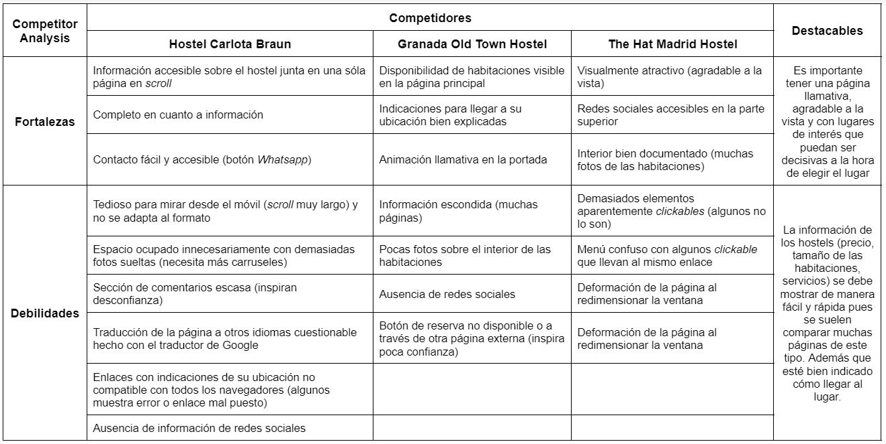
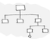
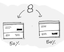

# DIU2.Loading
Prácticas Diseño Interfaces de Usuario 2021-22 (Tema: Hostels) 

Grupo: DIU2_Loading.  Curso: 2021/22 
Updated: 11/2/2022

>>> Decida el nombre corto de su propuesta en la práctica 2 

Proyecto: Noche de Stand-up Comedy

>>> Describa la idea de su producto en la práctica 2 

Descripción: 
Hemos decidido añadir una nueva actividad al establecimiento: Un Stand-up Comedy. Todos los martes se abrirá un espacio al público donde invitados especiales o cualquier persona mediante un formulario de inscripción podrá mostrar sus mejores chistes o monólogos y para pasar un buen rato. A diferencia de otros eventos donde la música está de ambiente aquí se pretende que los clientes interactúen con el que esté en el escenario y formen parte de ella mñas activamente

Logotipo: 
>>> Opcionalmente si diseña un logotipo para su producto en la práctica 3 pongalo aqui

Logotipo Principal

Versiones en blanco y negro:

Miembros
 * :bust_in_silhouette:   Ana García Muñoz     :octocat:     
 * :bust_in_silhouette:  Lorena Gómez Gómez     :octocat:
 * :bust_in_silhouette:  Leticia Quiñones Rodríguez     :octocat:

----- 

# Proceso de Diseño 

## Paso 1. UX Desk Research & Analisis 

 1.a Competitive Analysis
-----

>>> Describe brevemente características de las aplicaciones que tienes asignadas, y por qué has elegido una de ellas (150-300 caracteres) 

La página web principal a analizar nos ha sido asignada por subgrupos (hostel Carlota Braun). Las otras Granada Told Town y The Hat Madrid Hotel nos llamaron la atención por cómo se presentaban, su temática similar y las diferencias entre las páginas web

 1.b Persona
-----

>>> Comenta brevemente porqué has seleccionado a esas personas y sube una captura de pantalla de su ficha  (80-150 caracteres)

  Los hemos escogido al ser clientes potenciales (16-30 años) que podrían estar interesados en los servicios que ofrece.

 1.c User Journey Map
----

>>> Comenta brevemente porqué has escogido estas dos experiencias de usuario (y si consideras que son habituales) (80-150 caracteres) 

  Según la personalidad y forma de ser de cada uno, elegimos escenarios que se adaptaban a ellos y que podría ocurrir a otro cliente con intenciones similares.

 1.d Usability Review
----
>>>  Revisión de usabilidad: (toma los siguientes documentos de referncia y verifica puntos de verificación de  usabilidad
>>>> SE deben incluir claramente los siguientes elementos
>>> - Enlace al documento: https://github.com/lgomxz/DIU2.Loading/blob/main/P1/Usability-review.xlsx (sube a github el xls/pdf) 
>>> - Valoración final (numérica): 76
>>> - Comentario sobre la valoración:  (60-120 caracteres)
   Hay errores en enlaces de ubicación, el scroll puede optimizarse y faltan botones sociales. Por lo demás, es fácil de usar y llamativa.

## Paso 2. UX Design  

 2.a Feedback Capture Grid / EMpathy map / POV
----

>>> Comenta con un diagrama los aspectos más destacados a modo de conclusion de la práctica anterior,

  

    
>>> ¿Que planteas como "propuesta de valor" para un nuevo diseño de aplicación para economia colaborativa ?
>>> Problema e hipótesis
>>>  Que planteas como "propuesta de valor" para un nuevo diseño de aplicación para economia colaborativa te
>>> (150-200 caracteres)

 2.b ScopeCanvas
----
>>> Propuesta de valor 
 

 2.b Tasks analysis 
-----
>>> Definir "User Map" y "Task Flow" ... 

 2.c IA: Sitemap + Labelling 
----

>>> Identificar términos para diálogo con usuario  

 2.d Wireframes
-----

>>> Plantear el  diseño del layout para Web/movil (organización y simulación ) 

## Paso 3. Mi UX-Case Study (diseño)

 3.a Moodboard
-----
>>> Plantear Diseño visual con una guía de estilos visual (moodboard) 
>>> Incluir Logotipo
>>> Si diseña un logotipo, explique la herramienta utilizada y la resolución empleada. ¿Puede usar esta imagen como cabecera de Twitter, por ejemplo, o necesita otra?

La herramienta usada ha sido Medibang Paint, una aplicación móvil de dibujo.
La resolución que hemos usado para la imagen es: 1952x1929, aunque la hemos reducido para que quede mejor en el README.md.
Consideramos que no puede ser utilizada como cabecera por el formato que hemos propuesto, aunque sí como imagen de perfil.

>>> Paleta de colores 
Hemos tomado como colores del moodboard el rojo, el azul, el negro y el gris claro. Hemos mantenido la paleta de colores de la página web. El principal es el rojo, presente en el icono y la web. Es llamativo, energético y transmite comodidad. El negro, el gris claro y los toques azules (su complementario cercano) suavizan el rojo intenso presente en la paleta y la hace más agradable a la vista.

Logotipo 

  3.b Landing Page
----

>>> Plantear Landing Page 
 
 

 3.c Guidelines
----

>>> Estudio de Guidelines y Patrones IU a usar 
>>> Tras documentarse, muestre las deciones tomadas sobre Patrones IU a usar para la fase siguiente de prototipado. 
Patrones

Utilizando los patrones de diseño que proporciona las páginas UI Design patterns (https://ui-patterns.com/patterns) y Material Design(https://material.io/), hemos decicido aplicar:

Navegabilidad:

-Navegación inferior: La barra de navegación está dispuesta en la parte inferior de la pantalla. Está separada por secciones diferenciadas por iconos y a las que se puede acceder pulsando sobre éstos.

-Icono Home principal: Adicionalmente, arriba a la derecha se encuentra un botón (icono casa) con el que se puede acceder a la página principal de la aplicación.

Búsqueda: 

-Filtros de búsqueda: En la parte superior de la página en la que se muestran los eventos, hay una barra de búsqueda con la que se pueden encontrar coincidencias de texto. Ejemplo: Buscar el nombre de un cómico famoso.

Formulario:

-Formato estructurado: Para la inscripción del Stand-up comedy se proporciona un formulario de datos al usuario pidiendo la información requerida.

  3.d Mockup
----

>>> Layout: Mockup / prototipo HTML  (que permita simular tareas con estilo de IU seleccionado)

A continuación se puede observar la interfaz que hemos diseño y cómo funciona:

 3.e ¿My UX-Case Study?
-----

>>> Publicar my Case Study en Github..
>>> Documente y resuma el diseño de su producto en forma de video de 90 segundos aprox

## Paso 4. Evaluación 

 4.a Caso asignado
----

>>> Breve descripción del caso asignado con enlace a  su repositorio Github

 4.b User Testing
----

>>> Seleccione 4 personas ficticias. Exprese las ideas de posibles situaciones conflictivas de esa persona en las propuestas evaluadas. Asigne dos a Caso A y 2 al caso B
 

| Usuarios | Sexo/Edad     | Ocupación   |  Exp.TIC    | Personalidad | Plataforma | TestA/B
| ------------- | -------- | ----------- | ----------- | -----------  | ---------- | ----
| User1's name  | H / 18   | Estudiante  | Media       | Introvertido | Web.       | A 
| User2's name  | H / 18   | Estudiante  | Media       | Timido       | Web        | A 
| User3's name  | M / 35   | Abogado     | Baja        | Emocional    | móvil      | B 
| User4's name  | H / 18   | Estudiante  | Media       | Racional     | Web        | B 

. 4.c Cuestionario SUS
----

>>> Usaremos el **Cuestionario SUS** para valorar la satisfacción de cada usuario con el diseño (A/B) realizado. Para ello usamos la [hoja de cálculo](https://github.com/mgea/DIU19/blob/master/Cuestionario%20SUS%20DIU.xlsx) para calcular resultados sigiendo las pautas para usar la escala SUS e interpretar los resultados
http://usabilitygeek.com/how-to-use-the-system-usability-scale-sus-to-evaluate-the-usability-of-your-website/)
Para más información, consultar aquí sobre la [metodología SUS](https://cui.unige.ch/isi/icle-wiki/_media/ipm:test-suschapt.pdf)

>>> Adjuntar captura de imagen con los resultados + Valoración personal 

 4.d Usability Report
----

>> Añadir report de usabilidad para práctica B (la de los compañeros)

>>> Valoración personal 

>>> ## Paso 5. Evaluación de Accesibilidad  (no necesaria)

>>>   5.a Accesibility evaluation Report 
>>>> ----

>>> Indica qué pretendes evaluar (de accesibilidad) sobre qué APP y qué resultados has obtenido 

>>> 5.a) Evaluación de la Accesibilidad (con simuladores o verificación de WACG) 
>>> 5.b) Uso de simuladores de accesibilidad 

>>> (uso de tabla de datos, indicar herramientas usadas) 

>>> 5.c Breve resumen del estudio de accesibilidad (de práctica 1) y puntos fuertes y de mejora de los criterios de accesibilidad de tu diseño propuesto en Práctica 4.

## Conclusión final / Valoración de las prácticas

>>> (90-150 palabras) Opinión del proceso de desarrollo de diseño siguiendo metodología UX y valoración (positiva /negativa) de los resultados obtenidos  

